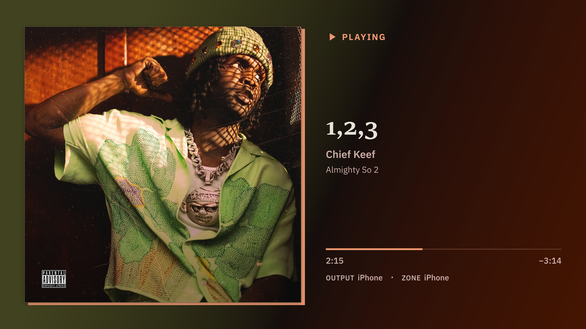
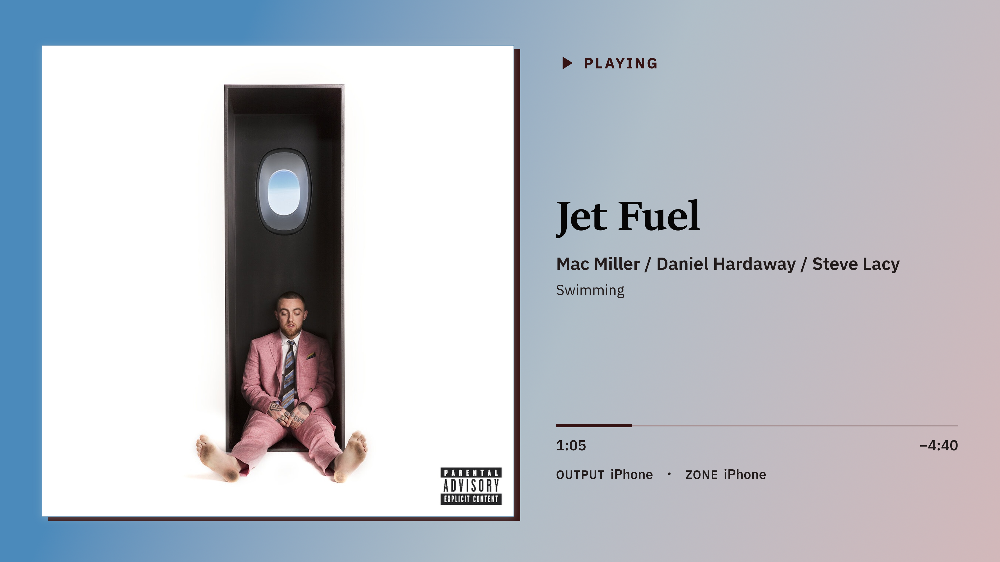
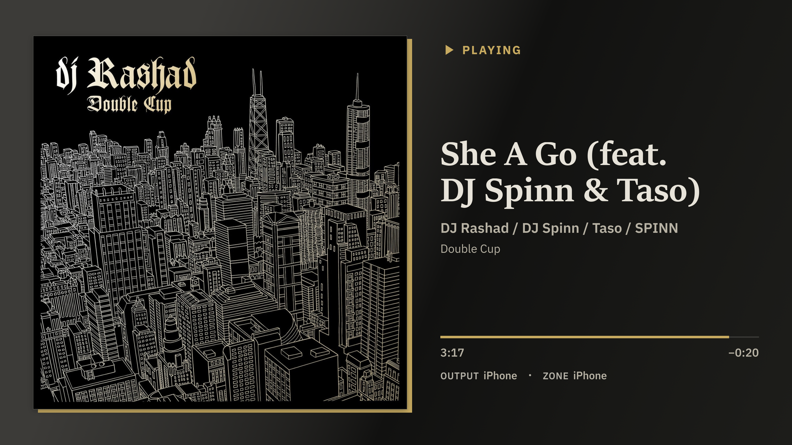

<picture>
  <source media="(prefers-color-scheme: dark)" srcset="docs/branding/roonscape-white-256.png">
  
</picture>

# RoonScape

RoonScape is a lightweight set-it-and-forget-it program to display what you're listening to with [Roon](https://roon.app).
Intentionally minimal and low-resource, it's capable of running on inexpensive hardware (a NUC can run it while also hosting a Roon server).
It displays album art, track details, and progress - a perfect companion to your home theater setup during a deep listening session.
Optional OLED protections help reduce burn-in risk by dimming and repositioning the presentation while playback is idle.

## Screenshots







## Requirements

- A Roon Server reachable over your local network.
- A Linux computer with glibc 2.35 or newer and GTK 4.6 or newer to run RoonScape (can be same machine as your Roon Server!).
- A device with a Roon client, used once for authorization of the app.

## Installation

From your home directory, download the latest release, extract it into the stable `roonscape` directory, and start it:

```sh
cd ~
curl --fail --location --output roonscape-linux-x64.tar.gz \
  https://github.com/gregbartell/roonscape/releases/latest/download/roonscape-linux-x64.tar.gz
tar --extract --gzip --file roonscape-linux-x64.tar.gz
./roonscape/roonscape
```

RoonScape will walk you through choosing the audio output to display and enabling OLED protection. For first-time setup and automatic launch guidance, see [Getting Started](docs/getting-started.md). For help with a problem, search or open an issue in [GitHub Issues](https://github.com/gregbartell/roonscape/issues).

## Development

Want to build RoonScape or contribute a change? Start with the [Development guide](docs/development.md).

RoonScape is available under the [MIT License](LICENSE).
